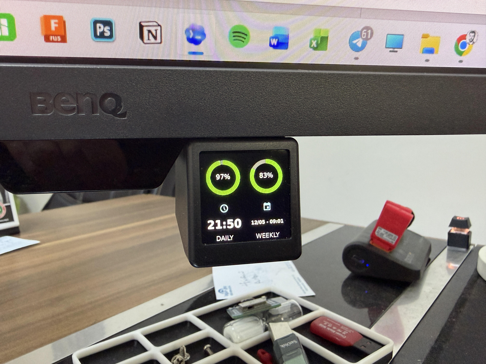
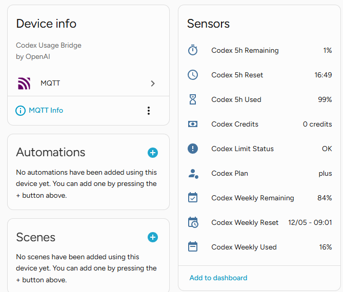

# Codex Home Assistant MQTT Bridge

Publish OpenAI Codex usage limits to Home Assistant over MQTT.

**Codex Home Assistant MQTT Bridge** reads the same Codex usage information used by the Codex client, normalizes it, and publishes Home Assistant MQTT Discovery entities for the 5-hour and weekly usage windows.

It is designed to be lightweight: there are no npm package dependencies, and the included Windows helper scripts can run the bridge silently in the background at sign-in.

---

## Features

- Publishes Codex usage to Home Assistant via MQTT.
- Creates Home Assistant sensors automatically with MQTT Discovery.
- Tracks 5-hour usage and remaining percentage.
- Tracks weekly usage and remaining percentage.
- Publishes retained state and availability topics for reliable Home Assistant restarts.
- Publishes reset times:
  - `Codex 5h Reset`: `16:49`
  - `Codex Weekly Reset`: `12/05 - 09:01`
- Publishes plan, credits, and limit status.
- Runs without npm dependencies.
- Includes Windows startup helpers that run silently in the background.

---

## Screenshots

Codex usage shown on a small Home Assistant dashboard display:



Home Assistant MQTT device and sensor entities:



---

## Home Assistant entities

The bridge publishes these sensors:

| Sensor | Example |
| --- | --- |
| `Codex 5h Used` | `49%` |
| `Codex 5h Remaining` | `51%` |
| `Codex 5h Reset` | `16:49` |
| `Codex Weekly Used` | `8%` |
| `Codex Weekly Remaining` | `92%` |
| `Codex Weekly Reset` | `12/05 - 09:01` |
| `Codex Credits` | `0 credits` |
| `Codex Plan` | `plus` |
| `Codex Limit Status` | `OK` |

All sensor values come from the retained JSON state payload on `codex/usage/state`, with bridge availability published on `codex/usage/availability`.

---

## How it works

1. The bridge reads Codex authentication data from your local Codex configuration directory, or from an optional access token fallback.
2. It requests Codex usage information from the Codex backend usage endpoint.
3. It flattens the response into simple values suitable for MQTT state payloads.
4. It publishes MQTT Discovery configs so Home Assistant creates the sensors automatically.
5. It periodically republishes the current usage state and availability.

Default MQTT topics:

```text
homeassistant/sensor/codex_usage/...
codex/usage/state
codex/usage/availability
```

---

## Requirements

- Windows, macOS, or Linux with Node.js 20 or newer.
- Home Assistant with MQTT enabled.
- A working MQTT broker, such as the Mosquitto add-on.
- A valid Codex login on the machine running the bridge.

The Windows helper scripts can also use the Node.js runtime bundled with the Codex desktop app when it is available.

---

## Quick start on Windows

1. Copy `.env.example` to `.env`.
2. Edit `.env` with your MQTT settings.
3. Double-click `start.bat` to test the bridge.
4. Double-click `install-startup-task.bat` to run it silently when you sign in to Windows.

Example `.env`:

```env
MQTT_URL=mqtt://192.168.1.50:1883
MQTT_USERNAME=ha_demo_user
MQTT_PASSWORD=your-password
POLL_SECONDS=60
```

Do not commit your `.env` file. It contains your MQTT password and may contain Codex-related credentials.

---

## Docker on Linux

The bridge can run in Docker without rewriting the app. The container uses Node.js and expects your Codex auth directory to be mounted at `/codex`.

1. Copy `.env.example` to `.env`.
2. Edit `.env` with your MQTT settings. Using an IP address for `MQTT_URL` is usually more reliable than `homeassistant.local` inside a container.
3. Make sure Codex auth exists on the Linux host at `~/.codex/auth.json`, or set `CODEX_ACCESS_TOKEN` in `.env`.
4. Start the bridge:

```sh
docker compose up -d --build
```

View logs:

```sh
docker compose logs -f
```

Stop the bridge:

```sh
docker compose down
```

The compose file mounts `~/.codex` into the container as `/codex` and sets `CODEX_HOME=/codex`. Keep that mount writable if you want the bridge to refresh and save Codex tokens. By default, the service runs as UID/GID `1000:1000`. If your Linux user has a different UID/GID, start it with matching values:

```sh
PUID="$(id -u)" PGID="$(id -g)" docker compose up -d --build
```

You can also run the image without Compose:

```sh
docker build -t codex-ha-bridge .
docker run -d \
  --name codex-ha-bridge \
  --restart unless-stopped \
  --user "$(id -u):$(id -g)" \
  --env-file .env \
  -e CODEX_HOME=/codex \
  -v "$HOME/.codex:/codex" \
  codex-ha-bridge
```

---

## Manual start

If Node.js is installed and available in your terminal:

```powershell
node src/index.js
```

Or through npm:

```powershell
npm start
```

If you are using the Windows helper:

```powershell
.\run.ps1
```

---

## Silent startup on Windows

To create a Windows startup shortcut:

```powershell
powershell -NoProfile -ExecutionPolicy Bypass -File .\install-startup-task.ps1
```

Or double-click:

```text
install-startup-task.bat
```

This creates a shortcut in the user's Windows Startup folder and starts the bridge immediately. It does not keep a terminal window open.

To remove the startup shortcut:

```powershell
powershell -NoProfile -ExecutionPolicy Bypass -File .\uninstall-startup-task.ps1
```

When installed as a silent Windows startup app, logs are written to:

```text
logs/bridge.log
```

---

## Configuration

| Variable | Default | Description |
| --- | --- | --- |
| `MQTT_URL` | `mqtt://homeassistant.local:1883` | MQTT broker URL. The built-in MQTT client supports `mqtt://`. |
| `MQTT_USERNAME` | empty | MQTT username. |
| `MQTT_PASSWORD` | empty | MQTT password. |
| `CODEX_HOME` | `~/.codex` | Codex config/auth directory. |
| `CODEX_ACCESS_TOKEN` | empty | Optional bearer token fallback. |
| `CHATGPT_ACCOUNT_ID` | empty | Optional account ID override when needed by the Codex backend request. |
| `CODEX_BACKEND_URL` | `https://chatgpt.com/backend-api/wham/usage` | Optional backend usage endpoint override. |
| `CODEX_REFRESH_TOKEN_URL` | `https://auth.openai.com/oauth/token` | Optional token refresh endpoint override. |
| `POLL_SECONDS` | `60` | How often to publish usage updates. |
| `MQTT_BASE_TOPIC` | `codex/usage` | MQTT state/availability topic prefix. |
| `HA_DISCOVERY_PREFIX` | `homeassistant` | Home Assistant MQTT discovery prefix. |
| `DEVICE_ID` | `codex_usage` | Home Assistant device identifier. |
| `DEVICE_NAME` | `Codex Usage` | Home Assistant device name. |

---

## Example Home Assistant dashboard cards

5-hour usage gauge:

```yaml
type: gauge
entity: sensor.codex_5h_used
name: Codex 5h
min: 0
max: 100
severity:
  green: 0
  yellow: 70
  red: 90
```

Weekly usage gauge:

```yaml
type: gauge
entity: sensor.codex_weekly_used
name: Codex Weekly
min: 0
max: 100
severity:
  green: 0
  yellow: 70
  red: 90
```

---

## Repository contents

```text
.
├── .env.example
├── .dockerignore
├── Dockerfile
├── docker-compose.yml
├── README.md
├── package.json
├── start.bat
├── run.ps1
├── run-service.ps1
├── run-hidden.vbs
├── install-startup-task.bat
├── install-startup-task.ps1
├── uninstall-startup-task.ps1
├── docs/
│   └── images/
└── src/
    ├── auth.js
    ├── codexUsage.js
    ├── config.js
    ├── index.js
    ├── mqttHa.js
    └── simpleMqtt.js
```

### Main files

- `src/index.js` — bridge entry point and polling loop.
- `src/config.js` — environment/config loading.
- `src/auth.js` — Codex authentication handling.
- `src/codexUsage.js` — Codex usage request and normalization.
- `src/mqttHa.js` — Home Assistant MQTT Discovery and state publishing.
- `src/simpleMqtt.js` — minimal MQTT client implementation.
- `start.bat`, `run.ps1`, `run-service.ps1`, `run-hidden.vbs` — Windows run helpers.
- `install-startup-task.ps1` / `uninstall-startup-task.ps1` — Windows startup shortcut management.

---

## Development / validation

This project has no npm dependencies. To validate JavaScript syntax:

```powershell
npm run check
```

The check script runs `node --check` against the source files.

---

## Troubleshooting

### Sensors do not appear in Home Assistant

- Confirm MQTT is enabled in Home Assistant.
- Confirm your MQTT broker URL, username, and password in `.env`.
- Check that Home Assistant MQTT Discovery is enabled.
- Check the bridge logs for MQTT connection errors.

### Usage values are not updating

- Confirm Codex is logged in on the same machine running the bridge.
- Confirm `CODEX_HOME` points to the correct Codex config/auth directory if you use a non-default location.
- Run the bridge manually with `node src/index.js` to see foreground logs.

### The Windows startup task does not run silently

- Re-run `install-startup-task.bat` or `install-startup-task.ps1`.
- Check `logs/bridge.log` in the repository directory.
- Confirm Node.js is available, or that the Codex desktop app bundled Node.js runtime can be found by the helper scripts.

---

## Security and privacy

- Do not commit `.env`.
- Do not share `CODEX_ACCESS_TOKEN` if you use it.
- The bridge does not publish your Codex token or MQTT password to Home Assistant.
- MQTT state payloads contain usage/limit information only, not authentication headers, refresh tokens, or raw credential objects.
- If OpenAI changes the Codex backend endpoint or response shape, the bridge may need an update.

---

## Notes and limitations

This project uses the Codex backend usage endpoint used by Codex itself. It is not a separately documented public API.

Because of that, endpoint paths, authentication behavior, or response formats may change without notice. If that happens, update the bridge before relying on it for automations or monitoring.
