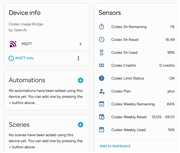

# Codex Home Assistant MQTT Bridge

Publish OpenAI Codex usage limits to Home Assistant over MQTT.

The bridge reads the same Codex usage information used by the Codex client, normalizes it, and publishes Home Assistant MQTT discovery entities for the 5-hour and weekly usage windows.

## Features

- Publishes Codex usage to Home Assistant via MQTT.
- Creates Home Assistant sensors automatically with MQTT discovery.
- Tracks 5-hour usage and remaining percentage.
- Tracks weekly usage and remaining percentage.
- Publishes reset times:
  - `Codex 5h Reset`: `16:49`
  - `Codex Weekly Reset`: `12/05 - 09:01`
- Publishes plan, credits, and limit status.
- Runs without npm dependencies.
- Includes Windows startup helpers that run silently in the background.

## Home Assistant Entities

The bridge publishes these sensors:

| Sensor | Example |
| --- | --- |
| `Codex 5h Used` | `49%` |
| `Codex 5h Remaining` | `51%` |
| `Codex 5h Reset` | `16:49` |
| `Codex Weekly Used` | `8%` |
| `Codex Weekly Remaining` | `92%` |
| `Codex Weekly Reset` | `12/05 - 09:01` |
| `Codex Credits` | `0 credits` |
| `Codex Plan` | `plus` |
| `Codex Limit Status` | `OK` |

## Screenshots

Codex usage shown on a small Home Assistant dashboard display:


Home Assistant MQTT device and sensor entities:



## Requirements

- Windows, macOS, or Linux with Node.js 20 or newer.
- Home Assistant with MQTT enabled.
- A working MQTT broker, such as the Mosquitto add-on.
- A valid Codex login on the machine running the bridge.

The Windows helper scripts can also use the Node.js runtime bundled with the Codex desktop app when it is available.

## Quick Start on Windows

1. Copy `.env.example` to `.env`.
2. Edit `.env` with your MQTT settings.
3. Double-click `start.bat` to test the bridge.
4. Double-click `install-startup-task.bat` to run it silently when you sign in to Windows.

Example `.env`:

```env
MQTT_URL=mqtt://192.168.1.50:1883
MQTT_USERNAME=ha_demo_user
MQTT_PASSWORD=your-password
POLL_SECONDS=60
```

Do not commit your `.env` file. It contains your MQTT password.

## Manual Start

If Node.js is installed and available in your terminal:

```powershell
node src/index.js
```

If you are using the Windows helper:

```powershell
.\run.ps1
```

## Silent Startup on Windows

To create a Windows startup shortcut:

```powershell
powershell -NoProfile -ExecutionPolicy Bypass -File .\install-startup-task.ps1
```

Or double-click:

```text
install-startup-task.bat
```

This creates a shortcut in the user's Windows Startup folder and starts the bridge immediately. It does not keep a terminal window open.

To remove the startup shortcut:

```powershell
powershell -NoProfile -ExecutionPolicy Bypass -File .\uninstall-startup-task.ps1
```

## Home Assistant MQTT Discovery

The bridge publishes MQTT discovery config under:

```text
homeassistant/sensor/codex_usage/...
```

The state topic is:

```text
codex/usage/state
```

The availability topic is:

```text
codex/usage/availability
```

## Example Dashboard Cards

5-hour usage gauge:

```yaml
type: gauge
entity: sensor.codex_5h_used
name: Codex 5h
min: 0
max: 100
severity:
  green: 0
  yellow: 70
  red: 90
```

Weekly usage gauge:

```yaml
type: gauge
entity: sensor.codex_weekly_used
name: Codex Weekly
min: 0
max: 100
severity:
  green: 0
  yellow: 70
  red: 90
```

## Configuration

| Variable | Default | Description |
| --- | --- | --- |
| `MQTT_URL` | `mqtt://homeassistant.local:1883` | MQTT broker URL. The built-in MQTT client supports `mqtt://`. |
| `MQTT_USERNAME` | empty | MQTT username. |
| `MQTT_PASSWORD` | empty | MQTT password. |
| `CODEX_HOME` | `~/.codex` | Codex config/auth directory. |
| `CODEX_ACCESS_TOKEN` | empty | Optional bearer token fallback. |
| `POLL_SECONDS` | `60` | How often to publish usage updates. |
| `MQTT_BASE_TOPIC` | `codex/usage` | MQTT state/availability topic prefix. |
| `HA_DISCOVERY_PREFIX` | `homeassistant` | Home Assistant MQTT discovery prefix. |
| `DEVICE_ID` | `codex_usage` | Home Assistant device identifier. |
| `DEVICE_NAME` | `Codex Usage` | Home Assistant device name. |

## Logs

When installed as a silent Windows startup app, logs are written to:

```text
logs/bridge.log
```

## Notes and Limitations

This project uses the Codex backend usage endpoint used by Codex itself. It is not a separately documented public API. If OpenAI changes the endpoint path or response shape, the bridge may need an update.

The bridge does not publish your Codex token or MQTT password to Home Assistant. Keep `.env` private.
